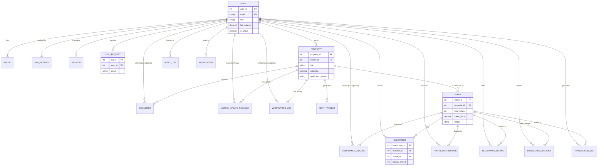

# Database Schema Analysis

This document provides a comprehensive analysis of the database schema for the FYP Application, including an ER diagram and detailed descriptions of the models and their relationships.

## Entity Relationship Diagram

## Core Entities

### 1. User Management
*   **User**: The central entity representing Investors, Property Owners, Admins, and Regulators. It stores profile information, authentication details, and a `fiat_balance`.
*   **Wallet**: Stores blockchain wallet addresses associated with a user. Supports multiple wallets per user.
*   **KYCRequest**: Stores identity verification data and documents for users. It follows a workflow from `pending` to `approved` or `rejected`.
*   **MFASetting**: Stores Multi-Factor Authentication configuration (TOTP secrets and backup codes).
*   **Session**: Manages user authentication sessions and refresh tokens.

### 2. Property & Tokenization
*   **Property**: Represents the real estate assets. Each property is owned by a `User` (Owner) and undergoes a verification process.
*   **Document**: Stores legal and technical documents related to a property, which are verified by regulators.
*   **Sukuk**: The tokenized representation of a property. It defines the total supply of tokens, their price, and the projected yield.
*   **RentPayment**: Tracks rental income generated by properties, which is later distributed to Sukuk holders.

### 3. Investment & Trading
*   **Investment**: Represents the primary market holdings of an investor in a specific Sukuk.
*   **SecondaryListing**: Allows investors to sell their Sukuk tokens to other users on a secondary market.
*   **ProfitDistribution**: Records the payouts made to investors based on their holdings.
*   **TokenPriceHistory**: Tracks changes in the price of Sukuk tokens over time.

### 4. Governance & Compliance
*   **ComplianceRecord**: Stores regulatory compliance checks performed on Sukuk issuances.
*   **ListingUpdateRequest**: A workflow for property owners to request changes to their property listings, subject to regulator approval.
*   **VerificationLog**: Detailed logs of the property and document verification process.
*   **AuditLog**: System-wide logs for tracking administrative and regulatory actions for transparency.
*   **TransactionLog**: Records financial and blockchain transactions for reconciliation and auditing.

## Key Relationships

*   **Property -> Sukuk**: A 1:N relationship where a property is tokenized into a Sukuk issuance.
*   **User -> Investment <- Sukuk**: A many-to-many relationship tracked via the `Investment` model, representing who owns which tokens.
*   **User -> Property**: Property owners manage their listings.
*   **Regulator (User) -> Governance**: Regulators interact with `Document`, `KYCRequest`, `Property`, and `ComplianceRecord` to ensure system integrity.

## Enumerations
The schema heavily uses Enums to enforce state transitions and roles:
*   `Role`: user, admin, regulator.
*   `KYCStatus`: pending, approved, rejected, etc.
*   `VerificationStatus`: draft, pending, approved, rejected.
*   `ListingStatus`: active, hidden, sold_out, suspended.
*   `TransactionType`: buy, sell, profit_payout, etc.
