# Database Schema Analysis

This document provides a comprehensive analysis of the database schema for the FYP Application, including a detailed ER diagram and model descriptions.

## Entity Relationship Diagram

```mermaid
%%{init: {
  'theme': 'base',
  'themeVariables': {
    'primaryColor': '#ffffff',
    'primaryTextColor': '#000000',
    'primaryBorderColor': '#333333',
    'lineColor': '#444444',
    'secondaryColor': '#f4f4f4',
    'tertiaryColor': '#ffffff',
    'fontFamily': 'inter, sans-serif',
    'fontSize': '14px'
  },
  'er': {
    'useMaxWidth': false,
    'layoutDirection': 'TB'
  }
}%%

erDiagram
    %% ==========================================
    %% GROUP 1: 👤 User & Auth (Blue)
    %% ==========================================
    User ||--o| MFASetting : "secures"
    User ||--o{ Session : "starts"
    User ||--o{ Wallet : "owns"
    User ||--o{ Notification : "receives"

    %% ==========================================
    %% GROUP 2: 📋 KYC & Compliance (Green)
    %% ==========================================
    User ||--o| KYCRequest : "submits"
    User ||--o{ AuditLog : "triggers (Actor)"
    User ||--o{ VerificationLog : "reviews (Regulator)"
    User ||--o{ ComplianceRecord : "verifies (Regulator)"
    
    %% ==========================================
    %% GROUP 3: 🏢 Property & Documents (Orange)
    %% ==========================================
    User ||--o{ Property : "owns (Owner role)"
    User ||--o{ Document : "verifies (Regulator role)"
    User ||--o{ ListingUpdateRequest : "reviews (Regulator role)"

    Property ||--o{ Document : "contains"
    Property ||--o{ RentPayment : "collects"
    Property ||--o{ VerificationLog : "generates history for"
    Property ||--o{ ListingUpdateRequest : "receives update for"

    %% ==========================================
    %% GROUP 4: 💰 Tokenization & Finance (Purple)
    %% ==========================================
    Property ||--o{ Sukuk : "tokenizes into"
    Sukuk ||--o{ Investment : "comprises"
    Sukuk ||--o{ ProfitDistribution : "yields"
    Sukuk ||--o{ TokenPriceHistory : "tracks price of"
    Sukuk ||--o{ TransactionLog : "logs (Asset view)"
    Sukuk ||--o{ ComplianceRecord : "governed by"
    Sukuk ||--o{ SecondaryListing : "traded in"

    %% User interactions with finance (various roles)
    User ||--o{ Investment : "made by (Investor role)"
    User ||--o{ ProfitDistribution : "received by (Investor role)"
    User ||--o{ TransactionLog : "triggers (Actor role)"
    User ||--o{ SecondaryListing : "created by (Seller role)"
    User ||--o{ TokenPriceHistory : "updated by (Admin role)"

    %% =========================================================================
    %% ENTITY DEFINITIONS & ATTRIBUTES
    %% =========================================================================

    User {
        int user_id PK
        string email "unique"
        string password
        enum role "user/admin/regulator"
        decimal fiat_balance
        string name
        boolean is_active
    }

    Wallet {
        int wallet_id PK
        int user_id FK "belongs to"
        string wallet_address "unique"
        boolean is_primary
    }

    MFASetting {
        int mfa_id PK
        int user_id FK "secures (unique)"
        boolean is_enabled
        string secret
        string_array backup_codes
    }

    Session {
        string session_id PK "uuid"
        int user_id FK "for"
        string refresh_token "unique"
        boolean is_valid
        datetime expires_at
    }

    Notification {
        int notification_id PK
        int user_id FK "received by"
        string message
        enum type
        boolean is_read
    }

    KYCRequest {
        int kyc_id PK
        int user_id FK "for (unique)"
        int reviewed_by FK "optional regulator review"
        string cnic_number "unique"
        enum status
        datetime submitted_at
    }

    ComplianceRecord {
        int compliance_id PK
        int sukuk_id FK "applies to"
        int verified_by FK "optional regulator review"
        string rule_applied
        enum compliance_status
        datetime timestamp
    }

    VerificationLog {
        int log_id PK
        int property_id FK "logs history for"
        int regulator_id FK "optional reviewer"
        enum status
        datetime timestamp
    }

    AuditLog {
        int log_id PK
        int user_id FK "performed by (Actor)"
        enum action
        enum module
        int targetId
        json details
    }

    Property {
        int property_id PK
        int owner_id FK "owned by (Owner role)"
        string title
        string location
        enum property_type
        decimal valuation
        enum listing_status
        enum verification_status
    }

    Document {
        int document_id PK
        int property_id FK "belongs to"
        int verified_by FK "optional regulator verify"
        string file_name
        string file_hash
        enum verification_status
    }

    ListingUpdateRequest {
        int request_id PK
        int property_id FK "for asset"
        int owner_id FK "optional request by"
        int reviewed_by FK "optional review by"
        string field_changed
        enum status
    }

    RentPayment {
        int rent_id PK
        int property_id FK "collected from"
        decimal amount
        datetime period_start
        datetime period_end
    }

    Sukuk {
        int sukuk_id PK
        int property_id FK "represents asset"
        int total_tokens
        int available_tokens
        decimal token_price
        enum status
    }

    Investment {
        int investment_id PK
        int investor_id FK "made by"
        int sukuk_id FK "in"
        int tokens_owned
        decimal purchase_value
    }

    ProfitDistribution {
        int distribution_id PK
        int sukuk_id FK "yielded by"
        int investor_id FK "optional recipient"
        decimal amount
    }

    TokenPriceHistory {
        int history_id PK
        int sukuk_id FK "for"
        int changed_by FK "optional updater"
        decimal old_price
        decimal new_price
    }

    SecondaryListing {
        int listing_id PK
        int seller_id FK "created by"
        int sukuk_id FK "of asset"
        int available_tokens
        decimal price_per_token
        enum status
    }

    TransactionLog {
        int transaction_id PK
        int user_id FK "triggered by"
        int sukuk_id FK "involves (optional)"
        enum type
        decimal amount
        enum status
    }
```

